# Universidade Europeia IADE
## Licenciatura em Engenharia informática
Docente: Pedro Rosa

# Briefing do projeto: Studycash
## 🔗 Links do repositório
[Repositório](https://github.com/samuel00ferreira00/StudiCash-.git)

## Autores

- [Constantino Chipopa](https://www.github.com/Chipopa1) - 20241231
- [Gilma Mulanda](https://www.github.com/Gilma-De-Sousa) - 20241087
- [Lueji Covilhã](https://www.github.com/lucovilha) - 20241725
- [Marlinda Congo](https://www.github.com/Marlinda21) - 20241718
- [Samuel Ferreira](https://www.github.com/samuel00ferreira00) - 20220755

## Introdução

O projeto baseia-se no desenvolvimento de uma aplicação móvel intitulada Studycash, que ajuda
estudantes a gerir as suas finanças pessoais de forma simples e prática. Incentivando decisões
financeiras conscientes, o hábito de economizar e a construção de uma base financeira estável para
o futuro.
O problema que este projeto procura resolver é a falta de ferramentas simples e adaptadas à rotina
dos estudantes para o controlo do dinheiro. Ao disponibilizar uma solução digital fácil de usar,
espera-se promover hábitos financeiros mais conscientes, melhorar o planeamento dos recursos e
incentivar uma relação mais equilibrada e responsável com o dinheiro no dia a dia académico.
## Enquadramento
### Problemática

Nos últimos tempos, temos notado que as pessoas têm tido sérios problemas com gerenciamento do seu dinheiro, o que consequentemente resulta em problemas financeiros e problemas no desenvolvimento pessoal e profissional da parte das pessoas. Para uma melhor gestão do seu dinheiro é necessário definir o que se pretende fazer, como fazer, e quando fazer. Resumidamente é necessário que se planifique para que se tenha uma boa educação financeira.

### Motivação

A motivação para a escolha deste tema surge da realidade financeira enfrentada por muitos
estudantes, que frequentemente têm dificuldade em gerir o seu dinheiro de forma adequada. A falta
de planeamento e de ferramentas adequadas pode levar a desequilíbrios financeiros,
endividamento e à incapacidade de alcançar objetivos pessoais ou académicos. Com o aumento do
uso de smartphones e da tecnologia no dia a dia, um aplicativo móvel representa uma solução
acessível e eficaz para ajudar os estudantes a acompanhar e organizar as suas finanças. Além disso,
o projeto pretende incentivar a educação financeira desde cedo, proporcionando aos jovens as
competências necessárias para tomar decisões mais conscientes e responsáveis sobre o uso do
dinheiro.
### Objectivo geral

O principal objetivo deste projeto é desenvolver um aplicativo móvel para gestão de finanças
pessoais direcionado a estudantes, oferecendo uma ferramenta prática e acessível que auxilie no
planeamento e controlo dos recursos financeiros.

### Objetivos específicos:

Para alcançar esse objetivo geral, definem-se os seguintes objetivos específicos:
• Permitir o registo de receitas e despesas de forma simples e organizada;
• Facilitar a criação e acompanhamento de orçamentos mensais, ajudando o utilizador a controlar
melhor os seus gastos;
• Proporcionar a definição de metas de poupança, incentivando a construção de hábitos financeiros
saudáveis;
• Disponibilizar relatórios e gráficos que apresentem a evolução financeira ao longo do tempo;
• Promover a educação financeira entre estudantes, contribuindo para uma gestão mais consciente
e responsável do dinheiro.

### Público alvo 

A aplicação é destinada a estudantes do ensino secundário e superior que procuram gerir as suas
finanças pessoais de forma organizada e eficiente. Além dos estudantes, a aplicação também pode
ser útil para jovens em início de vida profissional, contribuindo para o desenvolvimento de hábitos
financeiros responsáveis e para uma melhor planeação económica pessoal.

## Aplicações existentes

Temos como exemplo as aplicações abaixo que apresentam funcionalidades e objetivos alinhados
com os propostos no Studycash.
• SpendeeSpendee
• MoneyManeger
• SimpleMoney
• You need a budget (YNAB)
## Guiões

Menu principal
Passos:
• Abre o aplicativo → é direcionado para a Página Inicial.

• Vê o saldo atual e o resumo das receitas e despesas.

• Analisa as transações recentes (ex.: “Almoço RU”, “Mesada”).

• Clica em “Ver todas” para abrir o histórico completo.

• Observa se está a gastar mais do que recebe e planeia ajustes futuros.
Histórico de Transações

Passos:
• No menu inferior, seleciona “Transações”.

• Vê os totais de Receitas e Despesas destacados no topo.

• Usa o campo “Buscar transações…” para encontrar algo específico.

• Filtra por “Todas”, “Receitas” ou “Despesas”.

• Analisa cada item com data, categoria e valor (ex.: “Material Escolar -45,50 €”).

Adicionar Nova Transação
Passos:

• Toca no botão “+” do menu inferior.

• Escolhe o tipo de transação:

• Despesa (ex.: almoço, transporte)

• Receita (ex.: mesada, salário)

1. Preenche os campos:

a. Título (ex.: “Almoço no RU”)

b. Valor (ex.: “12,50 €”)

2. 3. c. Categoria (ex.: “Alimentação”)

d. Data

Clica em “Adicionar Despesa” ou “Adicionar Receita”.

A transação aparece automaticamente na lista e atualiza o saldo.

Orçamento

Passos:
• No menu inferior, seleciona “Orçamento”.

• Observa o Gasto Total e o Orçamento Planeado.

• Acompanha a barra de progresso para ver o percentual utilizado.

• Analisa o gráfico de Distribuição de Gastos por categoria (Alimentação, Educação,
Transporte, etc.).

• Verifica na seção “Por Categoria” quais áreas estão a consumir mais do orçamento.

• Faz ajustes nos gastos para manter-se dentro dos limites mensa
Metas
Passos:
• No menu inferior, toca em “Metas”.

• Preenche o formulário com:
• Título (ex.: “Viagem”)

• Valor da meta (ex.: “220 €”)

• Categoria e Data.

• Clica em “Adicionar Meta”.

• Acompanha o progresso (ex.: “70 € de 220 € – 70%”).

• Usa essa visualização para motivar-se a economizar e atingir o objetivo
Perfil
Passos:

1. Clica no ícone “Perfil” no canto superior direito.

2. Visualiza seus dados:
    a. Nome, e-mail e área de estudo.

3. Consulta estatísticas gerais:

    a. Total de transações realizadas e valor economizado.

4. 5. 6. Ativa ou desativa notificações financeiras.

Entra em Metas Financeiras para editar objetivos.

Clica em “Sair da Conta” quando quiser encerrar a sessão.

## Descrição genérica da solução a implementar

A solução proposta consiste no desenvolvimento de um aplicativo móvel multiplataforma voltado
para a gestão de finanças pessoais de estudantes. O sistema permitirá que os utilizadores registem
receitas e despesas, definam orçamentos mensais, estabeleçam metas de poupança e consultem
relatórios e gráficos financeiros de forma simples e acessível. A aplicação será desenvolvida com
base em programação orientada a objetos e utilizará uma base de dados relacional para armazenar
e organizar as informações financeiras com segurança. A interface será intuitiva e responsiva,
facilitando a navegação e o uso diário.

## Enquadramento nas unidades curriculares
O desenvolvimento deste projeto envolve cinco unidades curriculares, cada uma desempenhando
papéis específicos e contribuindo de diferentes formas, das quais podemos destacar:
• Matemática Discreta: Esta UC contribui diretamente para o desenvolvimento do projeto ao
fornecer as bases lógicas e estruturais necessárias para o planeamento e funcionamento do
aplicativo. Utilizando conceitos como lógica e álgebra booleana.
• Programação de dispositivos móveis: Representa a base técnica do projeto, pois será
responsável pela criação da interface do aplicativo utilizando as tecnologias Java/Kotlin e
jetpack compose.
• Programação orientada a objetos: Contribuirá para a implementação de servidores que
asseguram um fluxo de informações mais eficiente e estruturado, através da utilização de
frameworks como o Spring boot, que facilitam a construção, integração e manutenção dos
serviços back-end do aplicativo.
• Base de dados: Esta UC será responsável pela criação e gestão da base de dados que
armazenará todas as informações dos utilizadores, permitindo o seu acesso, atualização e
manipulação conforme as necessidades de funcionamento da aplicação. Para isso, será
utilizada a tecnologia SQL, garantindo uma estrutura de dados eficiente, segura e
organizada.
• Competências Comunicacionais: Esta UC será responsável por garantir a aplicação de
métodos e técnicas que possibilitarão uma apresentação mais eficaz do projeto, seguindo
as melhores práticas de comunicação e transmissão de informações.
## Requisitos técnicos para o desenvolvimento do projeto

1. Plataforma e Ambiente de Desenvolvimento
• Aplicação Android desenvolvida em Kotlin com Jetpack Compose.
• Backend em Java com Spring Boot, arquitetura MVC e API REST.
• Ferramentas: Android Studio Koala 2024.1.2, IntelliJ/Eclipse, Maven/Gradle.
2. Linguagens de promogramação
• Java (backend), Kotlin (frontend) e SQL (base de dados).
3. Banco de Dados
• Relacional: PostgreSQL ou MySQL.
• Tabelas: usuários, receitas, despesas, orçamentos e metas.
• Implementação via Spring Data JPA e CRUD completo.
4. Interface (UI/UX)
• Desenvolvida em Jetpack Compose, baseada no Material Design 3.
• Mockups obrigatórios no Figma.
• Interface responsiva, intuitiva e com gráficos interativos.
5. Segurança
• Login com e-mail e senha.
• Criptografia (BCrypt) e HTTPS.
• Validação de dados no cliente e servidor.
6. Gestão e Versionamento
• GitHub: código e documentação.
• ClickUp: gestão de tarefas.
• Discord: comunicação da equipa.
• Figma: protótipos.

##  Arquitetura de solução

Temos três camadas para a arquitetura de solução:
1. 2. 3. Camada de apresentação (Frontend): responsável pela interface do usuário.
Camada de lógica de Negócio (Backend): servidor e lógica da aplicação.
Base de dados: responsável pelo armazenamento de todas as informações do sistema.
Fronted
O frontend da aplicação será desenvolvido no Android Studio, utilizando a linguagem Kotlin e o
framework Jetpack Compose como suporte. A interface do utilizador permitirá gerir orçamentos e
despesas, interagir no chat geral e realizar análises financeiras com base nos gráficos gerados pela
aplicação.
Backend
O backend da aplicação, responsável pelas APIs e pelo servidor, será desenvolvido em Java
utilizando o framework Spring Boot. Além de gerir as APIs e o servidor, o Spring Boot será
utilizado para estabelecer as conexões entre o frontend e o servidor, e entre o servidor e a base de
dados, através da implementação de APIs RESTful. O backend terá como principal função
processar as requisições recebidas do frontend e gerir as operações do sistema, sendo
implementado com uma API simples e eficiente.
Base de dados
A base de dados será desenvolvida com MySQL, utilizando a linguagem SQL, e contará com
diversos mecanismos de proteção de dados integrados através do Spring Boot. Ela será responsável
por armazenar todas as informações relacionadas a orçamentos, despesas e utilizadores, garantindo
a segurança, integridade e disponibilidade dos dados.

## Tecnologias a utilizar
O desenvolvimento do projeto contou com as seguintes tecnologias:
Frameworks: Spring Boot
Website: Figma
Linguagens: Java, Kotlin e SQL
Aplicações: MYSQL Workbench, Gitbhub, Discord, Clickup, Visual Studio Code, Android Studio.

## Planeamento e calendarização
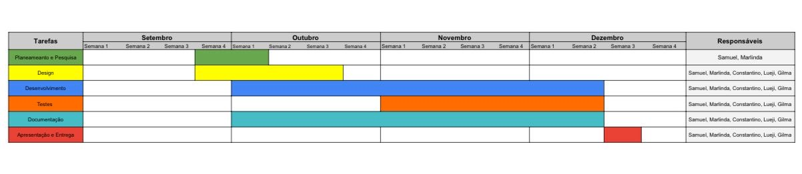

## Personas
O Gustavo, o Estudante Financeiramente Organizado
Idade: 21 anos
Curso: Engenharia de Software
Nível de conhecimento finaceiro: Avançado
Objetivos
• Controlar receitas e despesas mensais com precisão.
• Acompanhar metas de poupança (ex.: economizar para comprar um computador novo).
• Analisar gráficos e relatórios financeiros para otimizar gastos.
Comportamento e Frustrações
• Usa planilhas ou apps bancários, mas sente falta de uma ferramenta central e visual.
• Às vezes perde tempo ajustando categorias e valores manualmente.
• Quer evitar gastos repetitivos e compras impulsivas.
Motivações para usar o StudyCash
• Deseja um app intuitivo e analítico para gerenciar seu orçamento estudantil.
• Quer relatórios automáticos e alertas de limite de orçamento.
• Valoriza um design minimalista e funcional, que facilite a comparação entre meses.
Luzia, a Estudante Financeiramente Iniciante
Idade: 22 anos
Curso: comunicação Social
Nível de conhecimento finaceiro: Básico
Objetivos
• Aprender a gerir o próprio dinheiro de forma simples e prática.
• Evitar gastar mais do que ganha e criar hábitos de poupança.
• Ter uma visão clara de onde o dinheiro está sendo gasto.
Comportamento e Frustrações
• Costuma gastar por impulso e não acompanha seus gastos.
• Fica surpresa ao final do mês por não saber para onde o dinheiro foi.
• Acha os aplicativos financeiros difíceis e confusos, cheios de termos técnicos.
Motivações para usar o StudyCash
• Busca um app educativo e simples, com sistema de categorização automática de
despesas para compreender melhor onde gastar mais.
• Aprecia visualizar gráficos interativos e relatórios mensais que mostram a evolução
dos gastos.
• Valoriza receber notificações de limite de orçamento e definir metas financeiras que
ajudam a manter o controlo.

## Diagrama de classes

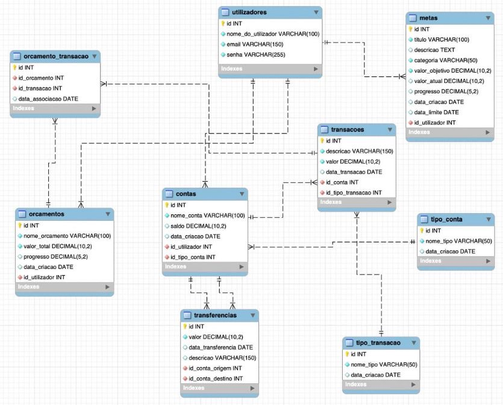

## Dicionário de dados
### Utilizadores
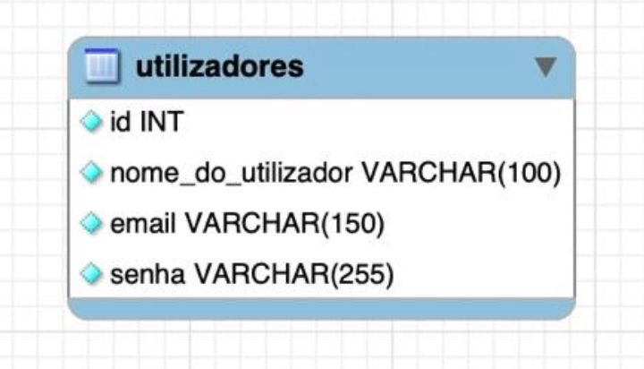
### Metas
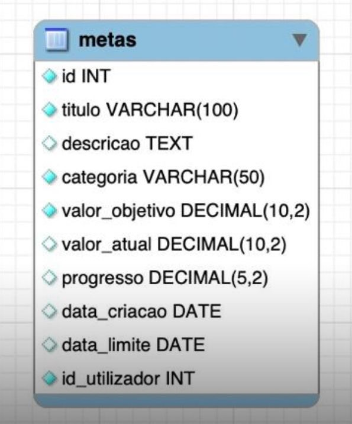
### Orçamentos
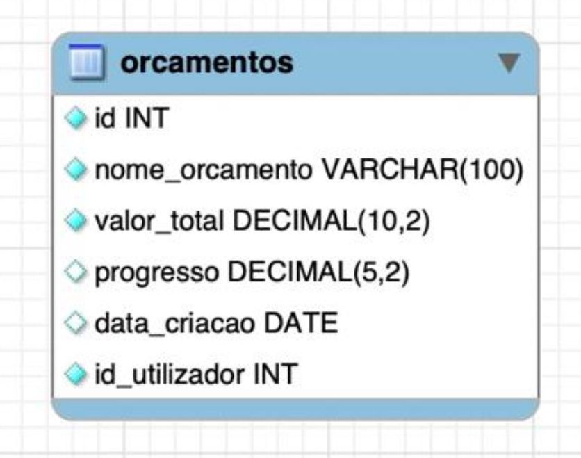
### Transações
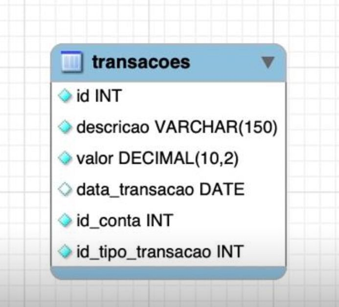
### Tipo transações
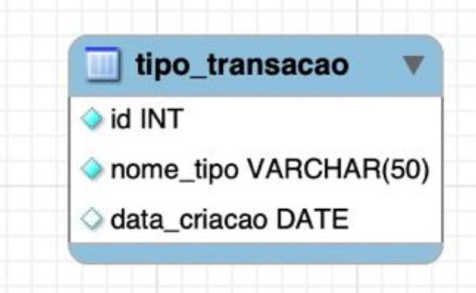
### Conta 
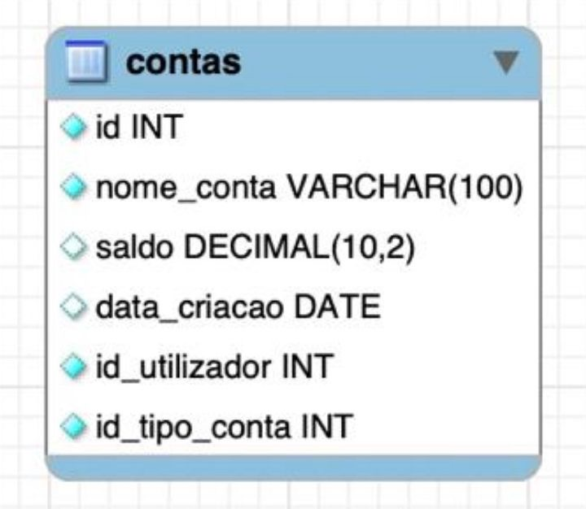
### Tipo de conta 
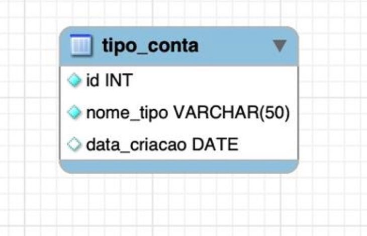
### Transferências

### Orçamento Transação 
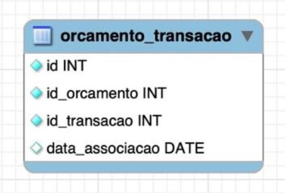

## MER
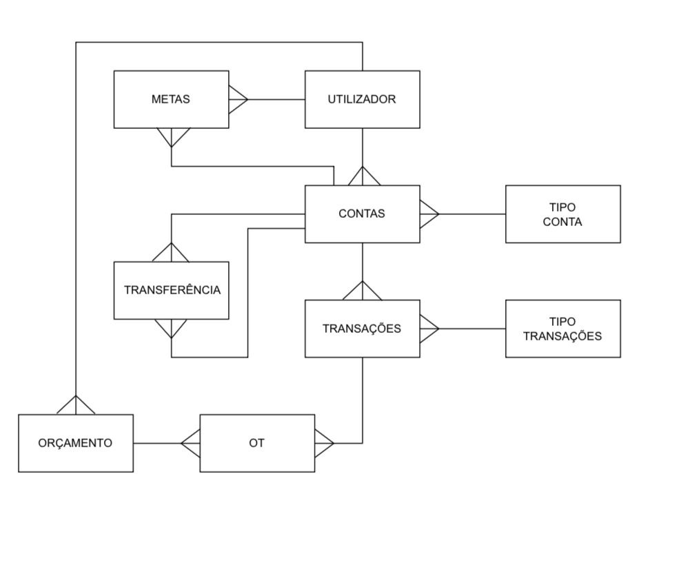

## Conclusão
O aplicativo studycash é uma solução prática e útil que surge para ajudar os
estudantes a organizar e gerir melhor as suas finanças pessoais. Com esta aplicação
móvel simples, moderna e acessível, pretende-se facilitar o registo de receitas e
despesas, a criação de orçamentos e metas de poupança, bem como a visualização
de relatórios financeiros de forma clara e objetiva.
Com estas funcionalidades, o studycash permitirá o utilizador acompanhar a sua vida
financeira em tempo real, tomar decisões mais conscientes e adotar hábitos de gestão
responsáveis e sustentáveis.
O seu objetivo principal é tornar a gestão financeira mais simples, acessível e eficaz
para os estudantes, promovendo maior controle e equilíbrio económico no dia a dia
académico e pessoal.

## Bibliografia

Krug, S. (2014). Don't Make Me Think: A Common Sense Approach to Web
Usability (3ª ed.). New Riders.
Investopedia. (2023). Personal Finance Basics: A Beginner's Guide to Financial
Literacy. Disponível em: https://www.investopedia.com
Android Developers. (2024). Build modern Android apps with Jetpack Compose.
Disponível em: https://developer.android.com/jetpack/compose
Deitel, P. J., & Deitel, H. M. (2020). Android for Programmers: An App-Driven
Approach. Pearson Education.
